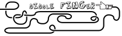
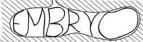
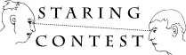
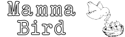
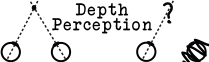
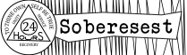
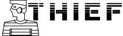
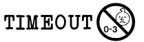

|ID|Block Name|Rule|Preview|
|----------------------|----------------------|------------------------------------------------------------------------------------------------------------------------------------------------|------------------------------------------------------|
|1|2 truths & a lie|tell 2 truths and a lie, everyone guesses the lie. drink everytime someone guesses correctly||
|2|4 Eyes|All people with glasses must have a drink.||
|3|Accent|You must speak in an accent for the rest of the game||
|4|Archenemy|give someone 4 drinks||
|5|arm wrestle|arm wrestle the person to your left. loser drinks||
|6|Baby Talk|you can only speak in one syllable words||
|7|Backseat driver|Person to your left picks the piece you pull||
|8|bar tender|you have to fetch everyones drinks||
|9|Batman|you have to talk like batman||
|10|battle of the sexes|everyone of the opposite sex drinks||
|11|Blind man|Locate the block and take it with your eyes closed||
|12|body guard|you pick someone and then taste their drink before them for the rest of the game||
|13|Boobs|Girls Drink||
|14|BRO|If you make eye contact with someone you have to high five - failure is a drink||
|15|Buckle Up|you are now buckled in, you must undo and redo your seat belt when you get up||
|16|Cartwheel|Pull a semi decent cartwheel and everyone else drinks.||
|17|Categories|Pick a category, everyone must say something in that category. First person to Fails drinks||
|18|Censored|When you Swear, You Drink||
|19|Cheers|Give 2, take 2||
|20|cocktail of doom|everyone else makes a shot out of whatever they want and you have to do||
|21|codenames|You are given a nickname that everyone must use for the rest of the game||
|22|compliments|give a compliment to everyone in the room||
|23|cray cray cat lady|drink for every cat you have ever owned||
|24|crypt keeper|oldest person drinks||
|25|Depersonalization|You cannot call anyone from their first name and you can't point at them - fail and drink||
|26|Dicks|Guys Drink||
|27|Dicktator|as long as this block is balanced on your head you are impervious from other blocks||
|28|Diddle Finger|You can only use one finger to remove blocks||
|29|ditto|pick someone to copy for the rest of the game, you drink when they drink and vice versa||
|30|Double Hands|You must drink with both your hands||
|31|down the hatch|finish your drink||
|32|drink pulling|remove a block while drinking||
|33|Drink swap|Swap your drink with someone else's||
|34|embryo|youngest person drinks||
|35|Eye Contact|You must maintain eye contact with the person opposite you while drinking||
|36|Fortune Teller|Predict the loser, if right, pick someone to be a loser with them. If wrong, you drink with the loser.||
|37|Ghost|Must reenact the scene from the movie Ghost and take the next piece out for the next person while behind them, arms around their body.||
|38|give 1|give 1||
|39|give 2|give 2||
|40|Give 3|give 3||
|41|God save the queen|If someone puts a coin in your drink you must drown it as the queen is drowning & its your civil duty to save her||
|42|Guess underwear colour|The player has to guess the other player's underwear colour, drinks for every wrong answer.||
|43|hand switch|use your non-dominant hand||
|44| | | |
|45|heads up|do not read aloud, throw this tile at someone. if they catch you drink otherwise they drink||
|46|i am groot|tallest person drinks||
|47|Jar Jar|You have to speak like JarJar Binks for the rest of the game||
|48|Know it all|If you are asked a question the person who answers drinks||
|49|Later|Person before you at some point in the game tells you to drink||
|50|Lightning Round|10 seconds between moving blocks - if you fail you drink||
|51|Made you blink|Challenge someone to stare down first one to blink drinks.||
|52|make a rule|make a rule that stands for the rest of the game||
|53|Mamma Bird|Person to your left has to lift your cup up to your mouth for you to drink||
|54|mini-me|shortest person drinks||
|55|musical chairs|play a round. looser drinks||
|56|Narcissist|Everyone Compliments you when they have to drink - no repeats||
|57|Neighbours|The two people next to you must drink||
|58|never have i ever|play a 3 finger game loser drinks||
|59|No Depth Perception|For the rest of the game you must drink with your eyes closed.||
|60|no guts no glory|you cant take any center pieces||
|61|not it|do not read aloud, the last player to touch there finger to their nose must drink 2||
|62|one must drink|everyone votes, person with most votes drinks||
|63|pass|you can hoard a later tile and pass it on to someone else||
|64|Peer Pressure|Drink 1 drink for each person playing the game||
|65|Pirate|YAAARRR, talk like a pirate for the rest of the game||
|66|Point of No Return|You must take a tile from within 3 rows of the top for the rest of the game.||
|67|Questions|Speak in questions only, first one to fail drinks||
|68|rainbow connection|pick a colour, everyone drinks if they are wearing that colour||
|69|Reverse|Order of play reverses||
|70|rewind|take a block from the top and put it back into the tower||
|71|Rhyme|Say a word, person to right has to say a word that rhymes with it. First person to not rhyme drinks||
|72|Rock, Paper, Scissors|On a count of 3, everyone throws down. You drink for every person who beats you. Every person who matches you gives Every person you beat drinks||
|73|Roger Roger|You must finish every sentence with "Roger Roger"||
|74|Royale we|refer to yourself as the royal "We"||
|75| | | |
|76|santa|sit on the person opposite lap for a round||
|77|sharing is caring|kings cup, everyone pours some of their drink into a cup and you drink||
|78|siblings|Drink 1 for every sibling you have||
|79|Skip|Skip the next player||
|80|slap|everyone gets a free slap on you during the game||
|81|snake eyes|if anyone looks into your eyes for the rest of the game they drink||
|82|Soberesest|The least drunk person in the group has to drink||
|83|sociable drinking|everyone drinks||
|84|speech|make a 60 second speech||
|85|spin the bottle|spin the bottle, looser drinks||
|86|Swine Rulls|You must point at a person to talk to them & every sentence has a swear||
|87|t-rex arms|you must do everything with t-rex arms for the rest of the game, elbows touching your sides||
|88|take 1|take 2||
|89|take 2|take 2||
|90|take 2 and redo|drink 2 and pull another tile||
|91|take 3|take 3||
|92|the real slim shady|stand for the rest of the game||
|93|Thief!!|Steal your neighbor's drink, and drink for them the rest of the game.||
|94|threeman|whenever a row is completed take a drink - if you complete a row you make someone else the threeman||
|95|time out|stand with your face in the corner of the room until your next turn. no talking or drinking||
|96|Touchy feely|Everyone must remove the first piece they touch||
|97|trivia|everyone else comes up with a trivia question to ask you. if you loose you drink. if you win they drink||
|98|truth or date|play truth or dare||
|99|Wasted Education|Drink 1 for every year you spent in college that is now meaningless in your chosen profession.||
|100|Waterfall|Everyone chugs there drink, When you stop person to your left stops and so on.||
